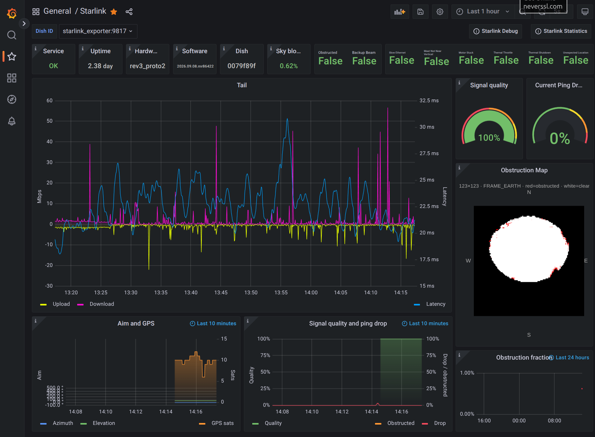

<p align="center">
  <a href="https://github.com/cahenesy/starlink">
    
  </a>

<h3 align="center">Starlink Monitoring System</h3>

<p align="center">
🛰️ Dish metrics, obstruction map, latency and speedtests for a current-firmware Starlink dish.
<br />
Fork of <a href="https://github.com/danopstech/starlink">danopstech/starlink</a> (2021). Not affiliated with Starlink™️
<br />
<br />
<a href="https://github.com/cahenesy/starlink/issues/new">Report Bug</a>
•
<a href="https://github.com/cahenesy/starlink/issues/new">Request Feature</a>
</p>

<p align="center">
    <a href="https://github.com/cahenesy/starlink/blob/main/LICENSE">
        
    </a>
    <a href="https://github.com/cahenesy/starlink/issues">
        
    </a>
    <a href="https://docs.docker.com/compose/compose-file/compose-versioning/">
        
    </a>
    <a href="https://github.com/prometheus/prometheus/releases">
        
    </a>
    <a href="https://github.com/grafana/grafana/releases">
        
    </a>
    <a href="https://github.com/prometheus/blackbox_exporter/releases">
        
    </a>
    <a href="https://github.com/danopstech/starlink_exporter/releases">
        
    </a>
    <a href="https://github.com/danopstech/speedtest_exporter/releases">
        
    </a>
</p>

<p align="center">
    
</p>

## 🏗️ Built With

- 🐳 **[Starlink exporter](https://github.com/danopstech/starlink_exporter)** - 2021 gRPC scrape of throughput, latency, alerts (still useful).
- 🐍 **obstruction-map** (this repo) - polls current `get_status` and `dish_get_obstruction_map` over gRPC-web; serves Prometheus metrics plus a 123×123 SNR PNG/JSON for Grafana.
- 🐳 **[Speedtest exporter](https://github.com/danopstech/speedtest_exporter)** - When asked it carries out a ping,upload and download test to [speedtest.net](https://www.speedtest.net/).
- 🐳 **[Blackbox exporter](https://github.com/prometheus/blackbox_exporter/)** - Carries out high frequency ping tests.
- 🐳 **[Grafana](https://grafana.com/)** - used to compose observability dashboards.
- 🐳 **[Prometheus](https://prometheus.io/)** - implements a highly dimensional data model.
- 🐳 **[Docker-Compose](https://docs.docker.com/compose/)** -  for defining and running multi-container Docker applications.

## 👋 Overview

I hope this project will make it easier for users to monitor their Starlink connection in even more detail, see its performance over time with each beta software release, but most importantly brag about their new satellite base internet to EVERYONE!

**What does this do?**
1. Collects dish throughput, latency and alerts every 3 seconds (2021 exporter)
2. Collects current-firmware identity, uptime, signal quality, aim/GPS and a 123×123 obstruction map every 10 seconds
3. Runs internet speed tests every 60 minutes (upload, download, ping)
4. Measures latency to multiple destinations globally every 3 seconds
5. Stores metrics in a local Prometheus TSDB and graphs them in Grafana

Current dish firmware reserved the 12 compass-wedge obstruction fields and `phy_rx_beam_snr_avg`. This fork drops those tiles and uses `DishObstructionStats` plus `dish_get_obstruction_map` instead.

<p align="center">
     
</p>

⚠️ IMPORTANT: When running; this will carry out speedtests every 60 minutes, which will download and upload a fair amount of data over time. Please bare this in mind if your internet connection fails over to tethered/mobile or a data chargeable supplier when Starlink is not available.

## 🏎️ Quick Start

If you have good knowledge of the above technologies, possibly a Developer, DevOps Engineer, etc then quick start is for you:

1. Clone the repo and `cd` into your local copy
2. `docker compose up --build -d`
3. Grafana is on `localhost:3000` (admin/admin)
4. Other services: Prometheus `9090`, dish exporter `9817`, obstruction map `9818`, blackbox `9115`, speedtest `9092`

## 🐢 Detailed Start (Slower Start)

### Pre-requisites
Ensure you install the latest version of docker and docker-compose on your host machine.

- [Docker](https://docs.docker.com/get-docker/)
- [Docker Compose](https://docs.docker.com/compose/install/)

To test you have both installed correctly, open your `Shell or Terminal` and run following commands:
```bash
$ docker --version
```
```bash
$ docker-compose --version
```

### Install

After installing the pre-requisites, You need all the files within this Github Repository downloaded to the machine you want to run the monitoring from.
This machine must be connected to the same network as the Starlink dish (more then likely the Starlink wifi).

- If you know `git` and have it installed then clone the repository - https://docs.github.com/en/github/creating-cloning-and-archiving-repositories/cloning-a-repository

- Or use Github desktop - https://desktop.github.com/

- Or if you don't know `git` and/or don't want to install it then you can download the files as a [zip here](https://github.com/cahenesy/starlink/archive/refs/heads/main.zip) or from clicking the green code button (top right)

> 💡 Please **Star** and **Watch** the repository to hopefully get updates as new features are added

Quick overview of the file structure you now have locally (for information only, you don't really need to know this):
```bash
starlink
├── .docs                      # Extra docs and images
├── config                     # Configuration for each service
│   ├── grafana            
│   │   └── provisioning       
│   │        ├── dashboards    # The preloaded dashboards
│   │        └── datasources   # The preloaded config to talk with prometheus
│   ├── prometheus             # Prometheus config file
│   └── blackbox               # Blackbox exporter config file
├── data                       # Persistent data (not committed)
│    ├── grafana
│    ├── prometheus
│    └── obstruction           # map.png / map.json written by the sidecar
├── obstruction-map            # Current-firmware gRPC-web poller
└── docker-compose.yaml        # Defines all the applications to run
```

### Setup

Open a terminal again and `cd` into the directory of your local copy. we will start all the services using Docker Compose and see logs on the terminal. The logs should quieten down, then your ready to read the "usage" section.

```bash
$ cd <path-to-your-copy>
$ docker compose up --build -d
```

### Upgrading

The Docker Compose file will run the latest versions of all the applications. To upgrade you need to pull the new image versions and then restart the current running ones. 

As we ran the original `docker-compose up` in the foreground, so we could watch the logs. Your need to open a new terminal and `cd` to the repository directory.

```bash
$ docker compose pull
$ docker compose up --build -d
```

### Stopping

To stop you can `ctrl-c` the foreground task in the original terminal and then:
```bash
$ docker compose down
```

## 📈 Usage (from the browser)

**Grafana:** 
- This is where the pretty graphs are
- Access via your browser at [http://localhost:3000](http://localhost:3000)
- The username and password is "admin" (no need to change it, its only local)
- Pre-loaded dashboards are Starlink, Speedtest, Ping

**Prometheus**
- If you know [promQL](https://prometheus.io/docs/prometheus/latest/querying/basics/), this is where you can create adhoc queries
- Access via your browser at [http://localhost:9090](http://localhost:9090)
- You can check the state of the exporters [here](http://localhost:9090/targets)

**Starlink Exporter**
- Standard usage there is no need to visit this
- Access via your browser at [http://localhost:9817](http://localhost:9817)
- `/metrics` link will get the latest metrics from the Starlink dish
- `/health` link shows you the gRPC connection state to the dish

**Obstruction map (this fork)**
- Access via your browser at [http://localhost:9818](http://localhost:9818) (PNG + N/E/S/W)
- `/metrics` is scraped by Prometheus (`starlink_status_*`, `starlink_obstruction_map_*`)
- Grafana also serves the same files at `/public/obstruction/map.json` (same-origin for the Plotly panel)
- Talks to the dish at `192.168.100.1:9201` (gRPC-web). Override `DISH_HOST` / `DISH_PORT` if needed.

**Speedtest Exporter**
- Standard usage there is no need to visit this
- Access via your browser at [http://localhost:9092](http://localhost:9092)
- `/metrics` link takes 40 seconds to load as it carries out a speedtest
- You might get an error `Limit of concurrent requests reached (1), try again later.` this means a speedtest is already running
- `/health` link shows you if it can reach the internet

**Blackbox Exporter**
- Standard usage there is no need to visit this
- Access via your browser at [http://localhost:9115](http://localhost:9115)
- Recent probes table shows you past ping test details

## 📖 Extras
### Running versioned images

If you would like more control over which versions of each image to run please visit: [Moving to versioned releases](.docs/versioned_releases.md)

### Small-disk Prometheus retention

Copy `docker-compose.override.example.yml` to `docker-compose.override.yml` (gitignored) to cap TSDB size/time.

### Pushing to a cloud based Grafana account

As standard all data stays on your local machine in the `data` folder. If you would like more information about pushing metrics into your own Grafana cloud account: [Pushing metrics to Grafana cloud](.docs/grafana_cloud.md)

## 📍 Roadmap
See the open [issues](https://github.com/cahenesy/starlink/issues).

## 🖋️ License
[GPL-3.0 License](LICENSE). This is a derivative of danopstech/starlink and must stay GPL-3.0.

## 😊 Author
Created in 2021 by [Dan Willcocks](https://github.com/dwillcocks). This fork (current dish firmware, obstruction map sidecar) is maintained by [Chris Henesy](https://github.com/cahenesy).

## 👎 Troubleshooting
Raise an [issue](https://github.com/cahenesy/starlink/issues/new). The dish must be reachable at `192.168.100.1` from the host running Compose. Native gRPC is `:9200`; this fork’s sidecar uses gRPC-web on `:9201`.

